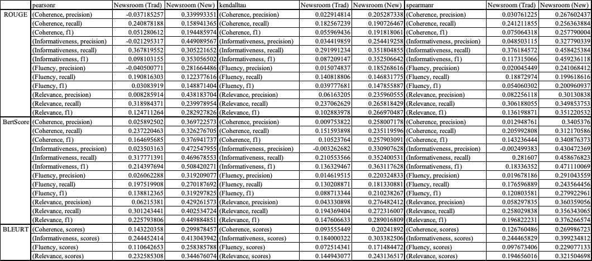
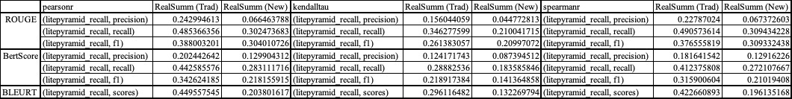

# Report

Author: Ruixuan Tu (ruixuan.tu@wisc.edu), University of Wisconsin-Madison

Idea: Forrest Sheng Bao (forrest.bao@gmai.com), Iowa State University

## Analysis

### 2022/07/01

In Progress …

### 2022/06/07

#### Expected Result

The correlation between human ratings and system scores should be stronger for the new approach than that for the traditional approach. If so, original documents would provide a better evaluation for system-generated summaries than human references.

#### Actual Result

We have computed system correlation in three methods of `pearsonr`, `kendalltau`, and `spearmanr`.

Values in the following table are already aggregated by means in every dataset. Non-aggregated data can be found at `model/corr.json` and `model/corr.xlsx`, extracted by Regex `.*: ([\d.]+),?`.

Pearson's correlation

| | Newsroom (Trad) | Newsroom (New) | RealSumm (Trad) | RealSumm (New) |
| - | - | - | - | - |
| ROUGE | 0.111061 | 0.276232 | 0.372121 | 0.224316 |
| BertScore | 0.161255 | 0.392830 | 0.329217 | 0.210390 |
| BLEURT | 0.182725 | 0.328996 | 0.449557 | 0.203801 |

Kendall's tau correlation

| | Newsroom (Trad) | Newsroom (New) | RealSumm (Trad) | RealSumm (New) |
| - | - | - | - | - |
| ROUGE | 0.106026 | 0.232939 | 0.254568 | 0.154928 |
| BertScore | 0.102421 | 0.270597 | 0.210638 | 0.137448 |
| BLEURT | 0.123753 | 0.230105 | 0.296116 | 0.132269 | 

Spearman's correlation

| | Newsroom (Trad) | Newsroom (New) | RealSumm (Trad) | RealSumm (New) |
| - | - | - | - | - |
| ROUGE | 0.139709 | 0.305936 | 0.364999 | 0.228713 |
| BertScore | 0.137906 | 0.355111 | 0.303305 | 0.203821 |
| BLEURT | 0.165888 | 0.304950 | 0.422660 | 0.196135 |

Non-aggregated correlation tables





#### Observation

We can see that (document, system summary) pairs is superior than (reference, system summary) pairs in terms of strength of correlation between human and system scores on Newsroom dataset. However, it is inferior on RealSumm dataset. This might be caused by that Newsroom's human reference (only the `ArticleTitle` field) is not ideal and appropriate for summary evaluation. Therefore, the new approach using (document, system summary) pairs seems to be better if the dataset does not have sufficient human reference.

### 2022/06/04

Results updated on 2022/06/07

#### Expected Result

There should be no major difference between the results from the new approach with (document, system summary) pairs and the traditional approach with (reference, system summary) pairs. If so, we could rely less on human generated summary (i.e., reference) to enable the training be less supervised, as document and system summary are extracted and generated without human intervention.

#### Actual Result

For ROUGE and BERTScore, we use the F-score (`fmeasure`, `f1`) of the medians, as it combines both precision and recall measures. For BLEURT, we use the median of all scores. For BLEU, we use the aggregated scores from the model.

| | Newsroom (Trad) | Newsroom (New) | RealSumm (Trad) | RealSumm (New) |
| - | - | - | - | - |
| ROUGE-1 | 0.1875 | 0.044964 | 0.346153 | 0.074613 |
| ROUGE-2 | 0.0 | 0.036036 | 0.116883 | 0.070127 |
| ROUGE-L | 0.125 | 0.039568 | 0.192307 | 0.074613 |
| ROUGE-Lsum | 0.125 | 0.039568 | 0.192307 | 0.074613 |
| BertScore | 0.824063 | 0.833208 | 0.889688 | 0.848760 |
| BLEU | 0.025807 | 1.52115e-07 | 0.2696018 | 4.773580e-12 |
| BLEURT | 0.159131 | 0.256110 | 0.353647 | 0.377492 |

#### Observation

For ROUGE and BLEU, the differences in results from traditional and new evaluation approaches are significant. For BertScore, BLEURT, the differences are not significant. Therefore, it seems to be better to replace with (document, system summary) pairs when we use the latter two metrics.

## Metrics

#### Scripts

- `eval.py`: Calculate scores on four metrics in old and new approaches, yields `model/newsroom.json`, `model/realsumm_abs.json`, and `model/realsumm_ext.json` (model output)
- `format.py`: Format model output from `eval.py` to feed to correlation calculator, yields `model/scores.json` (with consistent, non-aggregated format for `rouge1`, `rouge2`, `rougeL`, `rougeLsum`, `bertscore`, and `bleurt`; but aggregated format for `bleu`)
- `corr.py`: Compute the correlation between human ratings from datasets and scores from `model/scores.json` in old and new approaches, does not support `bleu` as the scores are already aggregated, yields `model/corr.pkl` and `model/corr.json`
- `analysis.py`: Aggregate scores from `eval.py` and analyze by median; aggregate correlation relationships from `model/corr.pkl` and analyze by mean; yields `analysis/rouge.json`, `analysis/bertscore.json`, `analysis/bleu.json`, `analysis/bleurt.json`, and `analysis/corr.json`

#### Formatted Scores

```json
{
    "newsroom": {
        "rouge1": {
            "trad": {
                "precision": [float]
                "recall": [float],
                "f1": [float]
            },
            "new": {...}
        },
        "rouge2": {...},
        "rougeL": {...},
        "rougeLsum": {...},
        "bertscore": {
            "trad": {
                "precision": [float],
                "recall": [float],
                "f1": [float]
            },
            "new": {...}
        },
        "bleurt": {
            "trad": {
                "score": [float]
            },
            "new": {...}
        },
        "bleu": {
            "trad": {
                "bleu": float (blue score),
                "precisions": [float] (geometric mean of n-gram precisions),
                "brevity_penalty": float,
                "length_ratio": float,
                "translation_length": int,
                "reference_length": int
            },
            "new": {...}
        }
    },
    "realsumm": {...}
}
```

#### Correlation (with mean)

```json
{
    "newsroom": {
        "rouge": {
            "trad": {
                "pearsonr": float,
                "kendalltau": float,
                "spearmanr": float
            },
            "new": {
                "pearsonr": float,
                "kendalltau": float,
                "spearmanr": float
            }
        },
        "bertscore": {...},
        "bleurt": {...}
    },
    "realsumm": {...}
}
```

### Model Output

#### ROUGE

https://huggingface.co/spaces/evaluate-metric/rouge

New Format:

```json
{
    "rouge": {
        "trad": {
            "rouge1": (List['float'])
            "rouge2": [...],
            "rougeL": [...],
            "rougeLsum": [...]
        },
        "new": {
            ...
        }
    }
}
```

Old Format:

```json
{
    "rouge": {
        "trad": {
            "rouge1": [
                Score(precision, recall, fmeasure),
                Score(...),
                ...
            ]
            "rouge2": [...],
            "rougeL": [...],
            "rougeLsum": [...]
        },
        "new": {
            ...
        }
    }
}
```

#### BERTScore

https://huggingface.co/spaces/evaluate-metric/bertscore

```json
{
    "bertscore": {
        "trad": {
            "precision": precision ([0.0, 1.0]) for each sentence from the predictions + references lists,
            "recall": recall ([0.0, 1.0]) for each sentence from the predictions + references lists,
            "f1": F1 score ([0.0, 1.0]) for each sentence from the predictions + references lists,
            "hashcode": (hashcode of the library) "roberta-large_L17_no-idf_version=0.3.11(hug_trans=4.19.2)"
        },
        "new": {
            ...
        }
    }
}
```

#### BLEU

https://huggingface.co/spaces/evaluate-metric/bleu

```json
{
    "bleu": {
        "trad": {
            "bleu": (float) blue score,
            "precisions": (List['float']) geometric mean of n-gram precisions,
            "brevity_penalty": (float),
            "length_ratio": (float),
            "translation_length": (int),
            "reference_length": (int)
        },
        "new": {
            ...
        }
    }
}
```

#### BLEURT

https://huggingface.co/spaces/evaluate-metric/bleurt

```json
"bleurt": {
    "trad": {
        "scores": (list) a list of scores, one per prediction
    },
    "new": {
        "scores": ...
    }
}
```

## References

- Forrest Sheng Bao, Ruixuan Tu. https://github.com/SigmaWe/DocAsRef
- Forrest Sheng Bao, Ge Luo, et al. SueNes: A Weakly Supervised Approach to Evaluating Single-Document Summarization via Negative Sampling. NAACL 2022. https://github.com/forrestbao/SueNes
